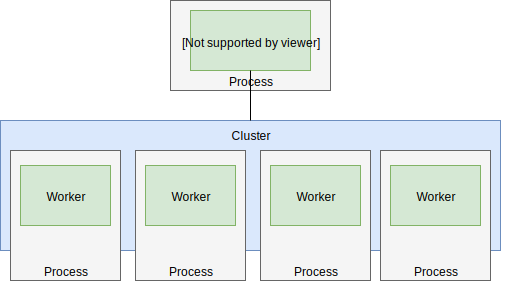
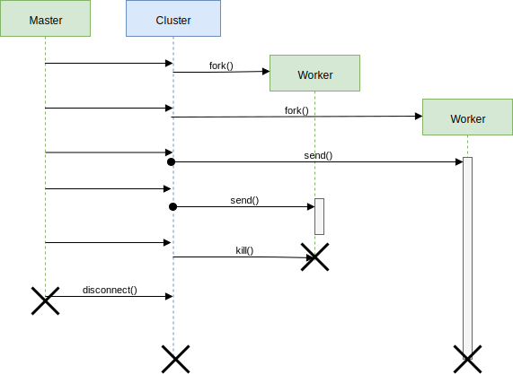

# Node Cluster
In this project node cluster technology is shown and communication pattern for usage as multithreading architecture is implemented.

## Node Cluster Architecture
A Node cluster architecture consists of a master that runs in the main thread and the cluster itself. The cluster administrates the workernodes each running an individual thread.
The master can invoke workers and send messages to them via the cluster api.

## Node Cluster Communication
As said above the master always uses the cluster api to communicate with workers. To instanciate workers the fork command is used. For communication the send command can be used. 
When disconnecting the master from the cluster the master thread will terminate. Then the cluster will shut down every idle worker. Busy workers will continue finishing their business before terminating. Therefore workers may live longer than the master.

## References
https://nodejs.org/api/cluster.html
